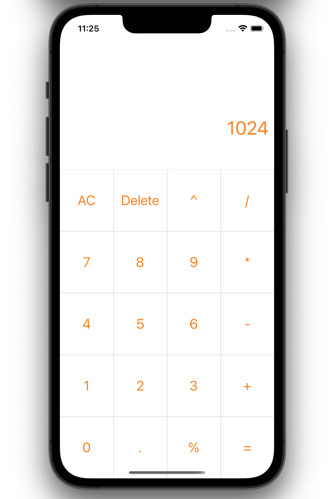
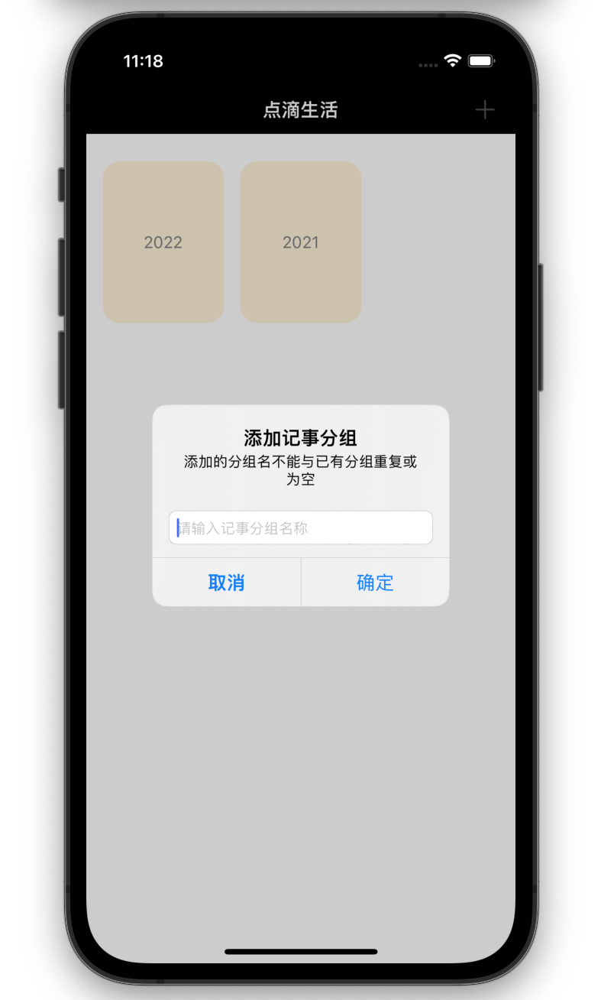
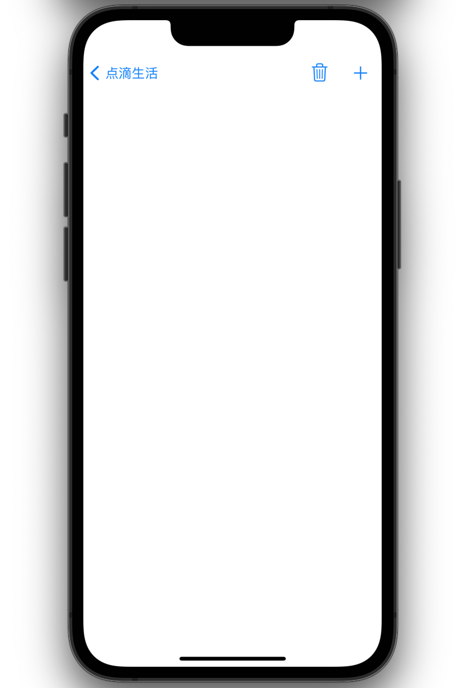
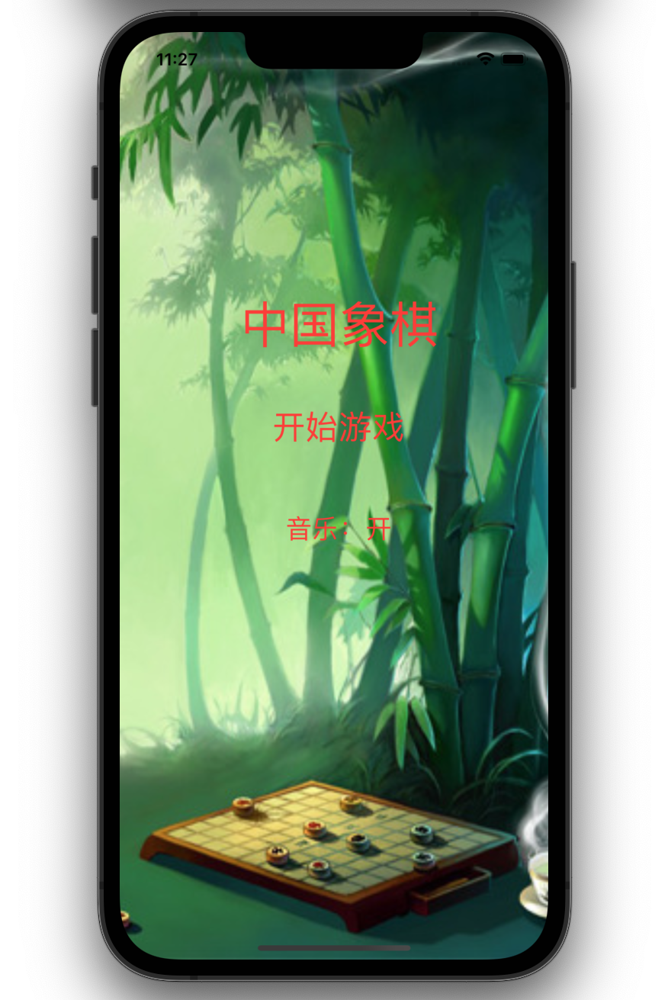
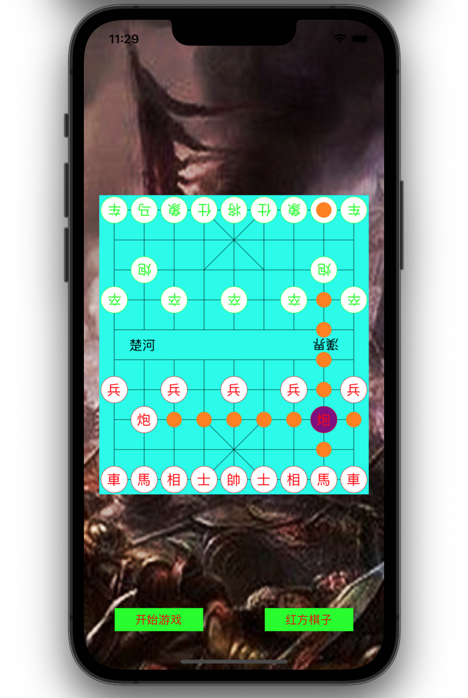
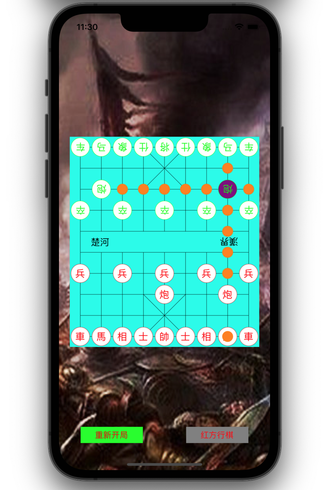

# SwiftProject

《Swift5从零到精通iOS开发训练营》里的三个实战练习代码

```zsh
Xcode 13.2.1
Apple Swift version 5.5.2 
```


### 计算器

`Calculator`文件夹



### 记事本

`NoteBook`文件夹





### 中国象棋雏形

`ChineseChess`文件夹

这个项目适配了iOS 12





